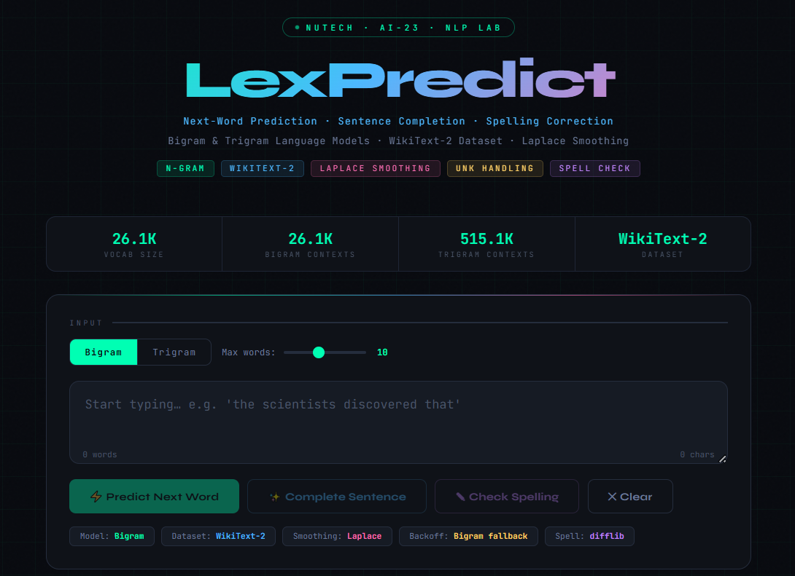

---

```markdown
# WordGenie— NLP Sentence Predictor

> **One-line Description:** Predict the next word and complete sentences dynamically using N-gram language models.

[](https://huggingface.co/spaces/Aenpi/nlp-sentence-predictor)  
[](https://python.org)  
[](https://flask.palletsprojects.com)  
[](https://huggingface.co/datasets/wikitext)  
[](LICENSE)

---

## 🔴 Live Demo

> 👉 **[Try NameIt Live](https://huggingface.co/spaces/Aenpi/nlp-sentence-predictor)**  

Experience **real-time next-word predictions** and **dynamic sentence completion** with a sleek interface.

---

## ✨ Features

- Bigram & Trigram language models with Laplace (Add-1) smoothing  
- WikiText-2 dataset (~2M tokens) — high-quality, coherent Wikipedia text  
- UNK handling — rare words replaced with `<UNK>` token  
- Trigram → Bigram backoff for unseen contexts  
- Top-5 next word predictions with animated probability bars  
- Greedy sentence completion with highlighted generated words  
- Session history — reload previous results easily  
- Keyboard shortcuts: `Ctrl+Enter` to predict, `Ctrl+Shift+Enter` to complete  
- Modern HTML/CSS/JS frontend — responsive dark futuristic theme  

---

## 🗂️ Project Structure

```

NameIt/
├── app.py            # Flask backend + NLP models + HTML frontend
├── requirements.txt  # Python dependencies
├── Dockerfile        # For Hugging Face Spaces (Docker SDK)
├── README.md         # This file
└── livedemo.png      # Screenshot of live demo

````

---

## 🚀 Deploy to Hugging Face Spaces

1. Go to [huggingface.co/spaces](https://huggingface.co/spaces)  
2. Click **"Create new Space"**  
3. Name it `nlp-sentence-predictor`  
4. Select **Docker** as the SDK  
5. Set visibility to **Public**

```bash
# Clone Space repo
git clone https://huggingface.co/spaces/Aenpi/nlp-sentence-predictor
cd nlp-sentence-predictor

# Add project files
git add .
git commit -m "Deploy NameIt NLP Predictor"
git push
````

> Wait a few minutes for Hugging Face to build your app.
> Live URL: `https://Aenpi-nlp-sentence-predictor.hf.space`

---

## 💻 Run Locally

```bash
git clone https://github.com/YOUR_USERNAME/NameIt
cd NameIt
pip install -r requirements.txt
python app.py
```

Open `http://localhost:7860` in your browser.

---

## 🧪 How It Works

**Dataset:** WikiText-2 (~2M tokens) — high-quality Wikipedia articles

**Bigram Model:**

```
P(w_i | w_{i-1}) = (count(w_{i-1}, w_i) + 1) / (count(w_{i-1}) + |V|)
```

**Trigram Model:**

```
P(w_i | w_{i-2}, w_{i-1}) = (count(w_{i-2}, w_{i-1}, w_i) + 1) / (count(w_{i-2}, w_{i-1}) + |V|)
```

**Backoff:** Trigram → Bigram if context unseen
**Laplace Smoothing:** Assigns small probability to rare/unseen sequences

---

## 📊 Model Statistics

| Metric         | Value                      |
| -------------- | -------------------------- |
| Dataset        | WikiText-2 (~2M tokens)    |
| Vocabulary     | ~10,000 words (min_freq=3) |
| Training Split | 90%                        |
| Smoothing      | Laplace (Add-1)            |
| Backoff        | Trigram → Bigram           |

---

## 👥 Group Members

| Name       | Email                                                 |
| ---------- | ----------------------------------------------------- |
| Aena Habib | **[aena@example.com](mailto:aena@example.com)**       |
| Member 2   | **[member2@example.com](mailto:member2@example.com)** |
| Member 3   | **[member3@example.com](mailto:member3@example.com)** |
| Member 4   | **[member4@example.com](mailto:member4@example.com)** |
| Member 3   | **[member3@example.com](mailto:member3@example.com)** |
| Member 4   | **[member4@example.com](mailto:member4@example.com)** |

---

## 📄 License

MIT License — free to use, distribute, and modify.

```
```
